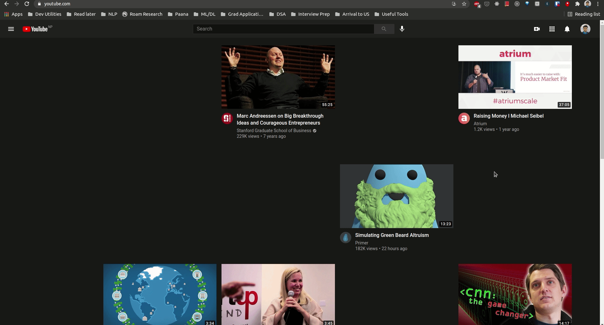

# YouTube Focus Mode

**YouTube Focus Mode** is a chrome extension that blocks and hides the videos in your feed that distract you and allows you to focus on videos that are important. Choose the categories of videos that you want to allow in your feed and all videos that don't belong to those categories will be blocked as distractions. 


## Installation

### A. Download as ZIP

The easiest way to begin using the extension is to download its build as a `.zip` file.

1. Download the `download/youtubefocusmode.zip` file from the repository.
2. Unzip the file to your desired directory.
```
$ unzip <DOWNLOAD DIRECTORY>/youtubefocusmode.zip -d <YOUR DESIRED DIRECTORY>
```
3. The extension will be unzipped into your desired directory. This directory contains the necessary `js` files and static files to run the extension.  

### B. Build Manually

You'll require `node` and `npm` to build the extension.

1. Clone the repository
2. Navigate to the project directory and install required dependencies
```
$ npm install
```
3. Build the extension
```
$ npm run build
```
4. After the build is complete, a `dist/` directory is created in the root directory of the project. This directory contains the necessary `js` files and static files to run the extension. 
 
### C. Loading into Chrome
To use the extension, load it into your Chrome browser:

   1. Open chrome and navigate to `chrome://extensions`
   2. Click on `Load unpacked` (Make sure that *Developer Mode* is enabled in Chrome).
   3. Select the directory containing the files of the extension that was created above in step `A3` or `B4`

## Usage

The first thing to do after installing **YouTube Focus Mode** is to choose the categories of videos that you'd like to allow in your feed in the **Focus Mode**. The categories of the video are fetched using the [YouTube Data API](https://developers.google.com/youtube/v3/docs/videoCategories/list?apix=true).

The extension can block/hide YouTube videos in 3 different scenarios:

- Home Feed
  - Hides the recommendation bar
  - Hides the videos belonging to *distractive* categories
  - Hides the sidebar
  

- Search Results
  - Hides the recommendation and filtering options
  - Hides the search results having videos from *distractive* categories.
  

- YouTube Video Player
  - Pauses and hides the video if it belongs to a *distractive* category
  - Hides the related videos in the right column that belong to *distractive* categories. 


## Contributing

Contributions in the form of code, documentation or simple feedback and suggestions are highly appreciated. Further details can be found in `contributing.md`